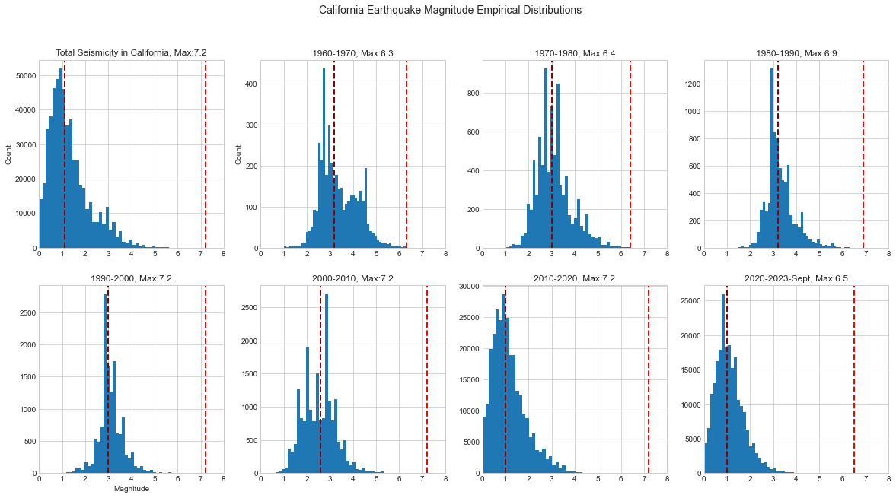
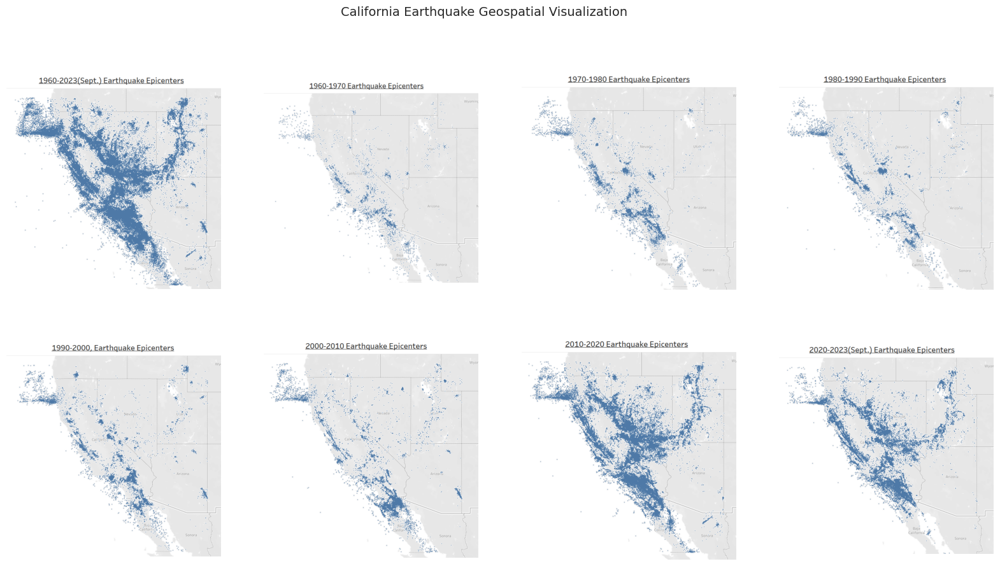
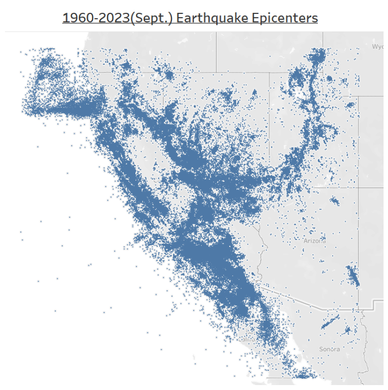
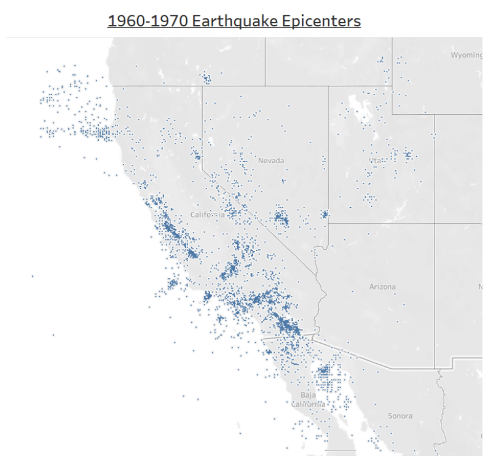
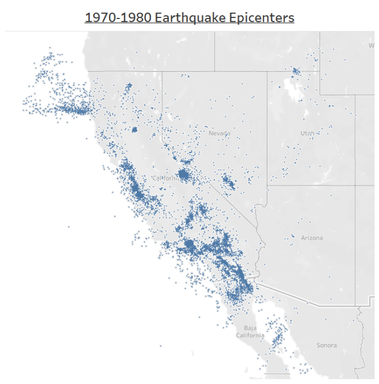
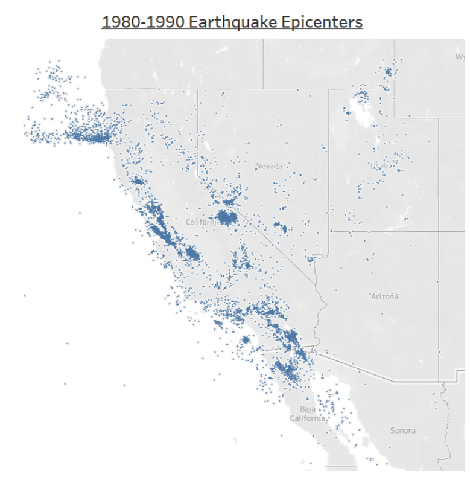
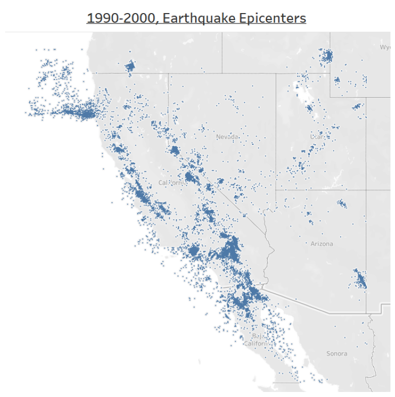
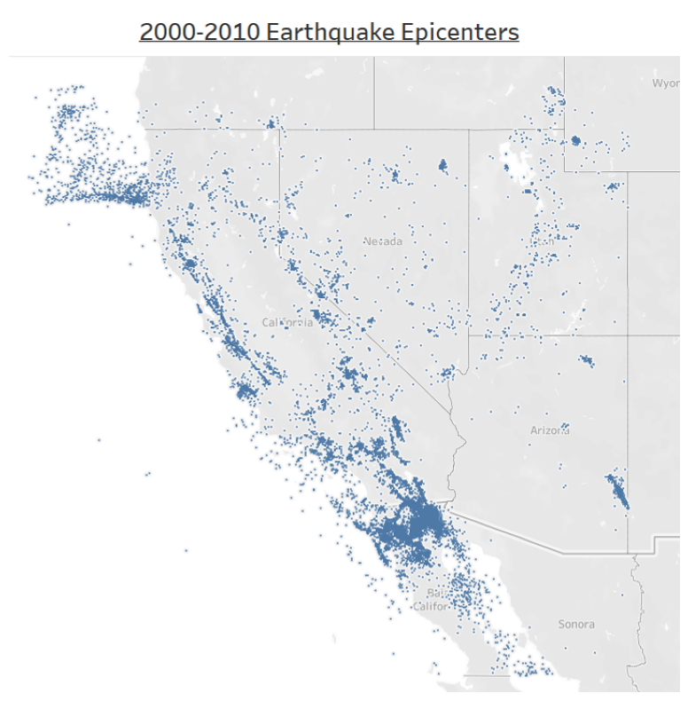
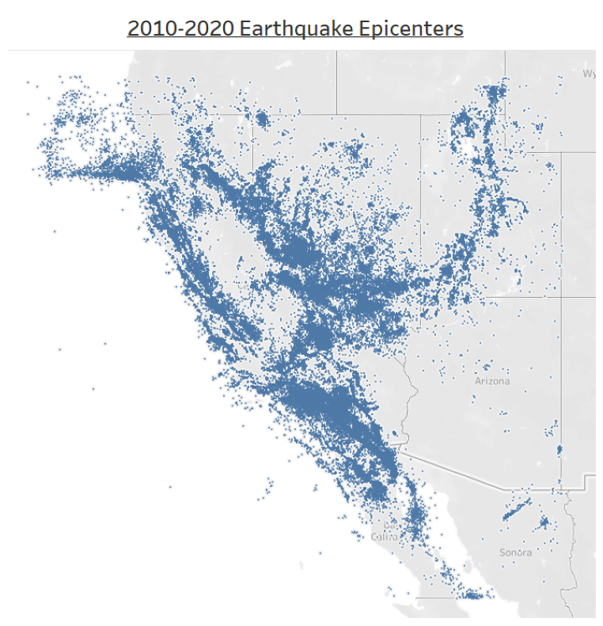
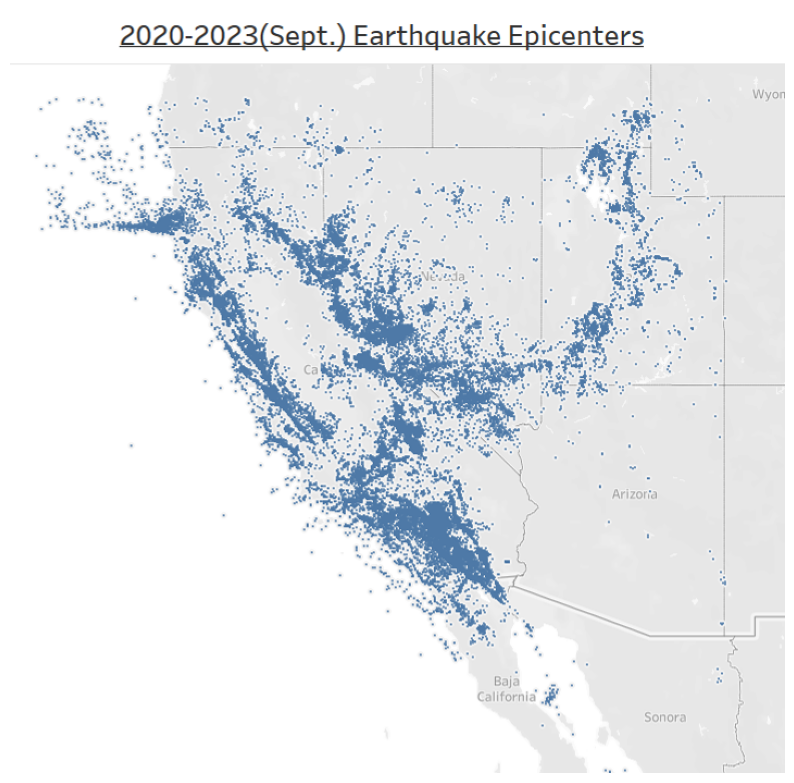

# Decade-by-Decade-Seismic-Events-in-California
A Python exploration of earthquake epicenter and magnitude patterns in California by decade from 1960 to 2023. 

## Introduction

I first encountered the idea that the Walker Lane could become the "new" San Andreas Fault in the future in the book "Earthquake Storms" by John Dvorak. 

The Walker Lane is a geologic trough roughly aligned with the border region of Nevada and California (think roughly from the Salton Sea up through Reno, Nevada). 

The Walker Lane is named after the mountain range in Nevada, and encompasses a number of fault systems, volcanic areas, and basins to the east of the Sierra Nevada mountain range.  

The idea that the Walker Lane could become the new San Andreas Fault in the future is grounded in observations that show that the Walker Lane is gradually taking over the role of accommodating the relative motion between the Pacific Plate and the North American Plate. It is suggested in "Earthquake Storms" that the shift eastward in seismic activity from the current San Andreas fault is tied to the creation of the Gulf of California and the separation of Baja California from mainland Mexico.

Currently, most of the plate boundary motion is absorbed by the San Andreas Fault. However, a significant portion of it, about 25%, is taken up by the Walker Lane, a series of faults that stretch from the Mojave Desert in southern California into western Nevada. Geological studies suggest that the Walker Lane is slowly expanding and evolving, taking on more of the strain from the moving plates over time.

If this trend continues, it is plausible that millions of years into the future, the Walker Lane could potentially become the primary boundary between the Pacific and North American Plates, effectively becoming the "new" San Andreas Fault. The process involves complex interactions between various fault systems and is influenced by the regional stress field, which can change over geological time scales.

Currently, the Walker Lane zone is characterized by a series of smaller northwest-southeast trending faults and fault basins.

## Visualizations from the Notebook and Discussion

In this notebook, we examine seismic data obtained from the IRIS seismic observation network, accessed through the Python Obspy library. We look at the full IRIS earthquake epicenter dataset starting from the earliest available data in 1960, looking for any hints at trends between the San Andreas Fault and the Walker Lane.

In the histograms below, the first line is the decade median earthquake magnitude, and the second (red) line marks the magnitude of the largest earthquake for the decade being visualized. 

It is interesting to note so many maximum magnitudes of 7.2. It is possible this is an artifact of the maximum sensitivity of the sensing systems underlying the IRIS observational network. This is a topic for future investigations and inquiry.

To begin understanding geospatial patterns that might eventually show evidence of changes in sesimic activity in the Walker Lane, we plot the geospatial patterns of earthquake epicenters decade by decade.

Then, zooming in on each map to get a better sense of possible patterns.

## Discussion and Next Steps

We note again the interesting ideas in the book "Earthquake Storms", summarizing research that suggests that the Gulf of California's recent geologic motion as a driving force behind the San Andreas Fault seismic activity shifting east to the Walker Lane Seismic Zone, passing through Reno, NV, and Lake Tahoe. The continutation of this trend in the future would result in the Intermountain Seismic Belt running through Utah, east of the Great Salt Lake, and into Idaho and Montana becoming the far future incarnation of the current San Andreas Fault.

It is interesting to consider whether we see evidence for seismic activity shifting eastward over the decades in the visualization above. The shift east, from the San Andreas Fault, to the Walker Lane (to the east of the Sierra Nevada mountains, through Reno, NV), and eventually to the Intermountain Seismic Belt (runs through the Middle of Utah). This trend is a known evolution of the seismic activity in the Western United States, but might need to have a seismic dataset that stretches over centuries to see the evolution of seismic activity east toward Utah. On top of this, we are certainly seeing the sensitivity of the sensor networks underlying IRIS increase through the years, and this will make drawing clear conclusions from this data more complex, a topic for a future study. 

Going beyond the current analysis, it would be interesting to perform geospatial and temporal clustering on this data to understand if there is clear order in space and time for the earthquake activity in California. There are some promising analysis libraries for this type of analysis, for example, **CGC:a Scalable Python Package for Co- and Tri-Clustering of Geodata Cubes**, https://pypi.org/project/clustering-geodata-cubes/ . CGC facilitates co-cluster and tri-cluster analyses on both local and distributed systems.CGC co-clustering implements the Bregman block-average co-clustering (BBAC) algorithm. The triclustering module in the CGC library gives a generalization of the co-clustering algorithm to three-dimensional arrays. For geospatial data, tri-clustering analyses allow extending the search for similarity patterns in data cubes. This allows for accounting for an extra dimension (the ‘band’ dimension) in addition to space and time. To go deeper, start here, Xiaojing Wu, Raul Zurita-Milla, Emma Izquierdo Verdiguier, Menno-Jan Kraak, **Triclustering Georeferenced Time Series for Analyzing Patterns of Intra-Annual Variability in Temperature**, Annals of the American Association of Geographers 108, 71 (2018)
